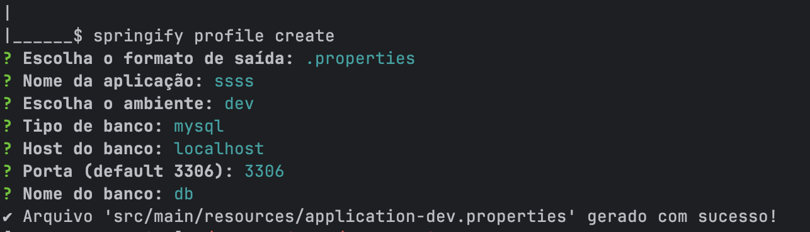

# Springify

**springify** é um CLI leve, rápido e interativo que gera arquivos de configuração para perfis de ambiente em projetos Spring Boot.

Ideal para devs que querem automatizar a criação dos arquivos `application.yml` ou `application.properties` com suporte a múltiplos perfis (dev, test, prod) e configuração de banco de dados — tudo sem complexidade.

---

## Tecnologias utilizadas

O `springify` foi desenvolvido em **Go (Golang)**, uma linguagem moderna e eficiente voltada para ferramentas robustas e multi-plataforma.

> A escolha pelo Go garante binários leves, rápidos e compatíveis com macOS, Linux e Windows — sem dependências externas.


## Funcionalidades

- Criação do arquivo principal: `application.yml` ou `application.properties`
- Geração de perfis separados: `application-dev.yml`, `application-prod.properties`, etc.
- Escolha interativa de ambiente, tipo de banco, nome da aplicação e formato
- Compatível com PostgreSQL, MySQL, Oracle e H2
- Binários prontos para **Linux**, **macOS (M1/M2)** e **Windows**

---

## Instalação

### ➤ macOS / Linux (instalação automática)

```bash
curl -sSL https://raw.githubusercontent.com/matheusvsdev/springify/main/install.sh | bash
```

Este instalador vai:

- Detectar seu sistema e arquitetura
- Baixar o binário correto da versão mais recente
- Mover o executável para /usr/local/bin/springify
- Validar se o comando foi instalado com sucesso

Depois disso, você pode usar springify direto no terminal.

### ➤ Windows (instalação manual)

1. Baixe o binário .zip pela aba Releases ou diretamente:

```bash
Invoke-WebRequest -Uri https://github.com/matheusvsdev/springify/releases/latest/download/springify-windows-amd64.zip -OutFile springify.zip
```
2. Extraia e renomeie:
```bash
Expand-Archive -Path springify.zip -DestinationPath .
Rename-Item -Path .\springify-windows-amd64.exe -NewName springify.exe
```

(Opcional) Adicione a pasta onde está o springify.exe ao seu PATH para usar de qualquer lugar no terminal.

## Como Usar

Execute no terminal:

```bash
springify profile create
```

Você será guiado interativamente para definir:

- Formato do arquivo: .yml ou .properties
- Nome da aplicação
- Ambiente: test, dev ou prod
- Tipo de banco: postgresql, mysql, oracle
- Host, porta e nome do banco (exceto para H2)

O CLI então criará:

- O arquivo principal `application.properties` ou `application.yml`
- O perfil escolhido com configurações específicas de banco

## Prévia do CLI

Veja como o springify interage com você no terminal:

> O CLI guia você por perguntas rápidas — gerando perfis de ambiente com clareza e agilidade.



## Estrutura gerada

Os arquivos serão criados dentro da pasta resources do projeto Java Spring Boot

```plaintext
src/
└── main/
    └── resources/
        ├── application.yml               // principal (ou .properties)
        ├── application-dev.yml           // perfil gerado
        └── application-test.properties   // exemplo de outro perfil
```

## Comunidade

Esse projeto é uma ponte entre a comunidade Go (ferramentas CLI) e a comunidade Spring Boot. Criado para devs que valorizam produtividade, automação e simplicidade na configuração de ambientes.

## Licença

Este projeto está sob a licença **Creative Commons BY-NC 4.0 (Atribuição – Não Comercial)**.

Você pode:

- Usar a ferramenta livremente em projetos pessoais, acadêmicos ou empresariais como auxiliar
- Modificar e estudar o código

Você **não pode**:

- Vender ou redistribuir o código do `springify`
- Atribuir a ferramenta a terceiros como se fosse própria

> O `springify` foi criado para facilitar o trabalho de quem desenvolve com Spring Boot.  
> Pode ser usado como utilitário auxiliar em empresas — exatamente como se usaria `npm install` ou uma imagem Docker.  
> A única exigência é **manter a atribuição** e não **revender ou publicar como se fosse seu**.  
> A licença existe apenas para proteger a autoria, não para limitar o uso legítimo da comunidade.

Saiba mais: [https://creativecommons.org/licenses/by-nc/4.0](https://creativecommons.org/licenses/by-nc/4.0)

Criado por [Matheus Valdevino](https://github.com/matheusvsdev)

---
